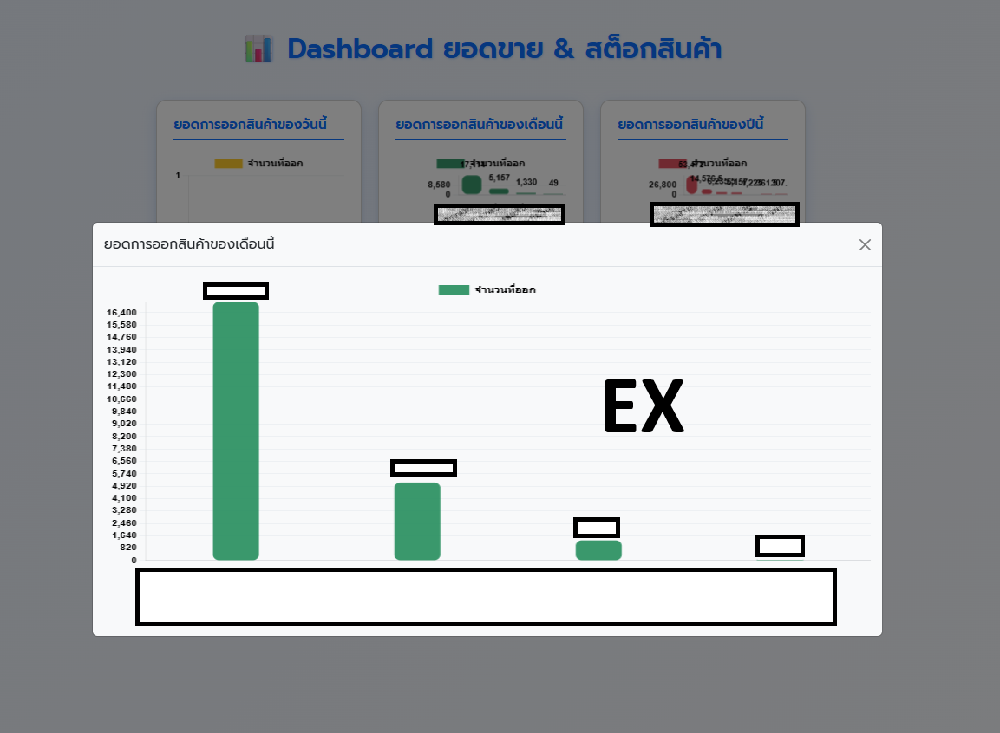
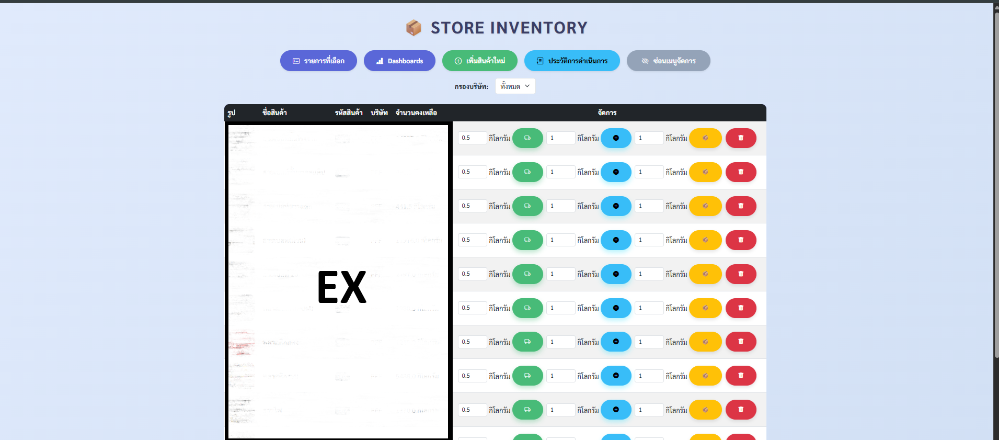

# 💻 Technical Portfolio | Singharach Kabir

Welcome to my project portfolio. Here is a collection of production-ready applications, AI solutions, and infrastructure systems I have designed and developed.

---

## 1. Warehouse Management Web Application (WMS)
A comprehensive full-stack digital solution for inventory tracking and warehouse operations.

### Tech Stack
* **Frontend/Backend:** Next.js
* **Database:** Supabase (PostgreSQL)

### Previews

### Key Features
* **Real-time Tracking:** Dynamic inventory tracking and transaction logging utilizing Supabase real-time capabilities.
* **Executive Insights:** Interactive dashboards providing daily, monthly, and yearly sales performance and stock-out trends.
* **Paperless Workflow:** Replaced manual paper-based tracking with a 100% digital solution.

---

## 2. AI Solutions & Cross-Network Data Integration
Advanced integration of Computer Vision, NLP, and localized networking engines.

### Tech Stack
* Python, OpenCV, NLP Frameworks

### Key Features
* **AI Object Detection:** Computer vision model trained to detect and prevent factory equipment collisions, enhancing floor safety.
* **AI Chatbot:** Integrated NLP chatbot to automate internal queries and streamline information retrieval.
* **Data Integration Engine:** Custom engine designed to synchronize facial recognition attendance data across isolated network segments without a unified LAN environment.

---

## 3. "BorrowMate" & Safety Management Systems
Automated solutions for corporate asset accountability and safety compliance.

### Tech Stack
* Python, SQLite, Tkinter, pyzbar (Barcode Scanning), ReportLab

### Previews

### Key Features
* **Barcode Integration:** Instant tool check-in/out via barcode scanning with automated transaction logging.
* **Asset Accountability:** Centralized database containing item specifications and real-time status tracking to eliminate tool loss.
* **Digital Compliance:** Mobile-accessible safety tracking system for fire extinguisher maintenance, ensuring 100% audit readiness.

---

## 4. Lift Tracker - Real-time Production & Weight Tracking System
A high-performance industrial web application for real-time monitoring of material weights and employee output.

### Tech Stack
* Next.js, Supabase, Supabase Auth

### Key Features
* **Strict Data Integrity:** Implemented robust Role-Based Access Control (RBAC) separating roles for manual entry, office administration, and IT oversight.
* **Optimized Workflows:** Responsive mobile-friendly interface designed for floor staff, accelerating data reporting by 80%.

---

## 5. Operations & Energy Monitoring
Deployment of internal operations software and physical infrastructure monitoring.

### Key Features
* **POSPOS Implementation:** Deployed the POSPOS system and conducted hands-on staff training for streamlined inventory and daily sales summarization.
* **Solar Kiosk Display:** Integrated third-party solar APIs into a custom Kiosk-mode dashboard, physically deploying display monitors in the control room for 24/7 energy tracking.

---

## 6. Hardware & Infrastructure
Enterprise-level storage solutions and workstation management.

### Key Features
* **NAS Deployment:** Architected and maintained NAS (Network Attached Storage) systems for secure centralized data backup and file management.
* **Hardware Maintenance:** Managed specialized hardware deployments (including GPS telematics) and conducted enterprise workstation diagnostics to ensure maximum system uptime.
